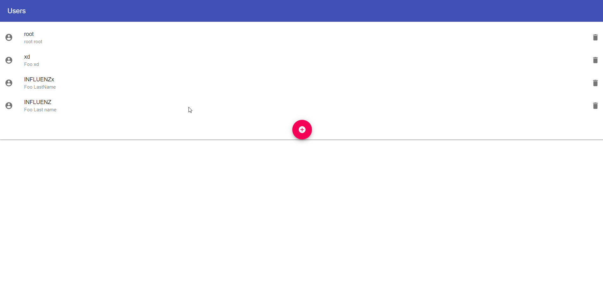
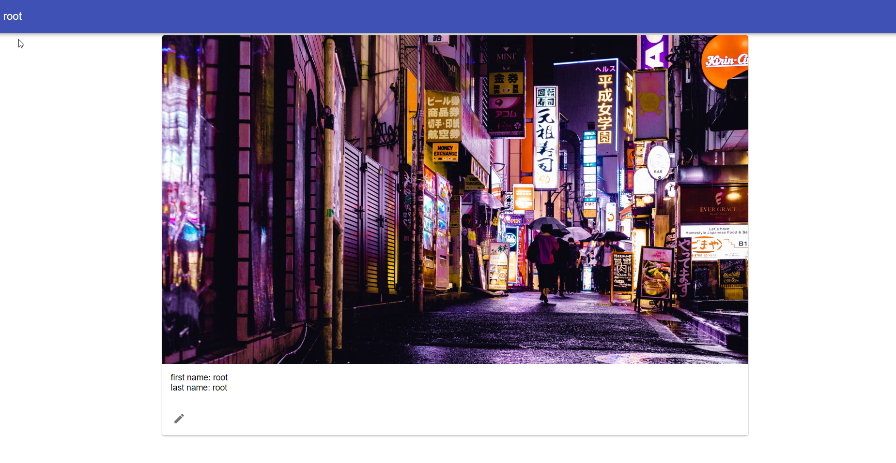
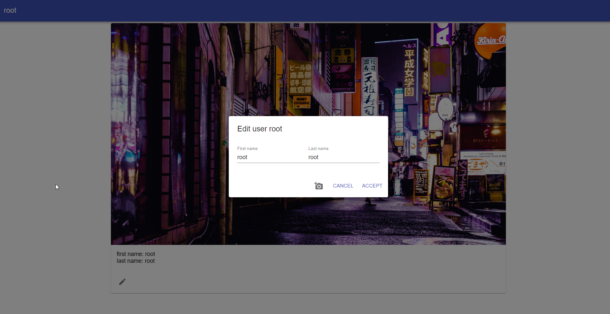
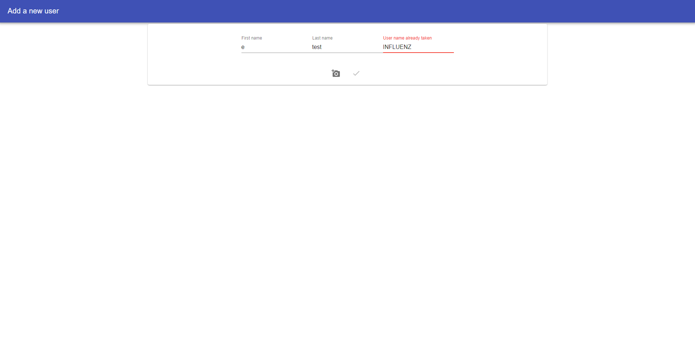

# React Client (Frontend)


<h3> Install dependencies </h3> 

``` npm install ```

<h3> Start application </h3>

``` npm run start ``` 

  <h3> Run tests </h3>

``` npm run test ```  

 <h3> Build application </h3>
   
``` npm run build ```  

 <h3> Eject </h3>  

``` npm run eject ``` 





